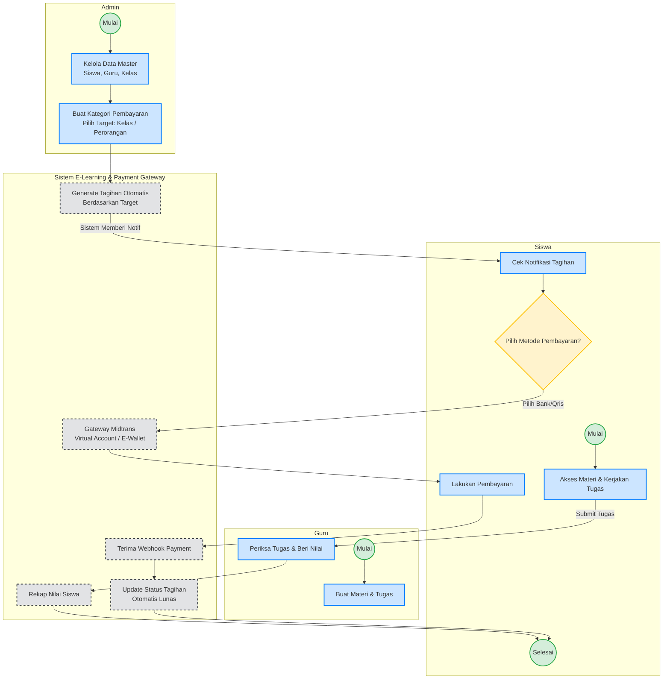

# Business Process Model and Notation (BPMN) To-Be: E-Learning System

Berikut adalah rancangan proses bisnis **To-Be** (yang diharapkan) untuk aplikasi E-Learning ini, mencakup dua pilar utama: **Kegiatan Belajar Mengajar (KBM)** dan **Administrasi Keuangan**.

Rancangan ini menggunakan *Swimlanes* untuk memisahkan peran dari masing-masing aktor: **Admin**, **Guru**, **Siswa**, dan **Sistem (E-Learning & Midtrans)**.

### Penjelasan Flow (To-Be)
1. **Pilar Akademik (KBM)**
   - **Guru** menyiapkan materi dan tugas.
   - **Siswa** mengakses materi tersebut, lalu mengerjakan dan mensubmit tugas.
   - **Guru** memberikan penilaian yang kemudian masuk ke **Sistem** untuk direkap (Transkrip/Rapor otomatis).

2. **Pilar Administrasi (Keuangan)**
   - **Admin** mengatur data utama dan membuat *Kategori Pembayaran*. Pada sistem *To-Be*, Admin bisa memilih apakah kategori ditujukan untuk **Satu Kelas** penuh atau **Perorangan (Siswa tertentu)**.
   - **Sistem** secara otomatis men-generate data tagihan (Billing) berdasarkan target yang dipilih Admin dan menampilkannya di dashboard siswa terkait.
   - **Siswa** melihat tagihan dan memilih saluran pembayaran melalui integrasi **Midtrans** (Virtual Account, QRIS, dll).
   - Setelah siswa membayar, Midtrans mengirimkan **Webhook** ke sistem.
   - **Sistem** memperbarui status tagihan menjadi *Lunas (Paid)* secara *real-time* tanpa perlu konfirmasi manual dari Admin.
