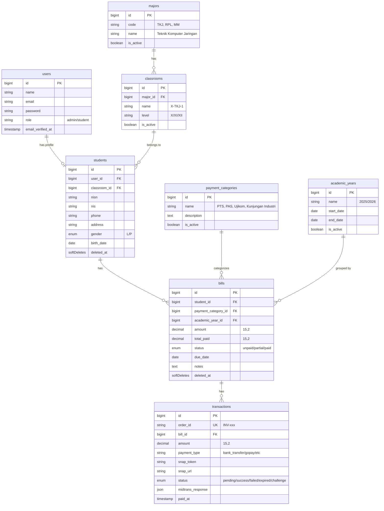

# E-Learning SMK — Database Schema & Payment System (Laravel 11 + Midtrans)

Membangun skema database lengkap untuk aplikasi e-learning SMK dengan integrasi pembayaran Midtrans untuk tagihan PTS, PAS, Ujikom, dan Kunjungan Industri.

## Rekomendasi & Pengembangan dari Request Awal

Berdasarkan kebutuhan Anda, saya merekomendasikan beberapa **pengembangan** agar sistem lebih robust dan production-ready:

> [!IMPORTANT]
> ### Tabel Tambahan yang Direkomendasikan
> 1. **`majors`** — Tabel master jurusan (TKJ, RPL, MM, dll.) agar tidak hardcode di `students`
> 2. **`classrooms`** — Tabel master kelas (X-TKJ-1, XI-RPL-2, dll.) dengan relasi ke jurusan
> 3. **`academic_years`** — Tahun ajaran aktif (2025/2026) untuk mengelompokkan tagihan per periode
> 4. **`payment_items`** — Detail item pembayaran (cicilan ke-1, ke-2) untuk mendukung pembayaran bertahap
> 5. **`midtrans_notifications`** — Log mentah webhook Midtrans untuk audit trail & debugging

> [!TIP]
> ### Best Practices yang Diterapkan
> - **UUID** pada `order_id` transaksi (format: `INV-{timestamp}-{random}`) untuk keamanan
> - **Soft Deletes** pada tabel kritis (`students`, `bills`) agar data tidak hilang permanen
> - **Enum via string** (bukan MySQL ENUM) untuk fleksibilitas status
> - **Decimal(15,2)** untuk nominal uang (bukan float/double)
> - **Index** pada kolom yang sering di-query (`status`, `order_id`, `snap_token`)
> - **Cascading** yang aman: `onDelete('restrict')` untuk data keuangan

## Open Questions

> [!IMPORTANT]
> 1. **Apakah ingin mendukung pembayaran cicilan/bertahap?** — Jika ya, saya akan tambahkan tabel `payment_items` untuk memecah 1 bill menjadi beberapa cicilan.
> 2. **Apakah perlu tabel `academic_years` (tahun ajaran)?** — Berguna untuk mengelompokkan tagihan per periode.
> 3. **Apakah field `nisn` dan `nis` diperlukan di tabel `students`?** — Standar data siswa SMK.

## Proposed Changes

### ERD (Entity Relationship Diagram)



---

### 1. Database Migrations (10 files)

#### [NEW] `create_majors_table` migration
- Tabel master jurusan: `code`, `name`, `is_active`
- Seed default: TKJ, RPL, MM, AKL, OTKP

#### [NEW] `create_classrooms_table` migration
- FK ke `majors`, field: `name`, `level` (X/XI/XII), `is_active`

#### [NEW] `create_academic_years_table` migration
- Periode tahun ajaran: `name`, `start_date`, `end_date`, `is_active`

#### [NEW] `add_role_to_users_table` migration
- Tambah kolom `role` (default: `student`) ke tabel `users` bawaan Laravel

#### [NEW] `create_students_table` migration
- FK ke `users` dan `classrooms`
- Field: `nisn`, `nis`, `phone`, `address`, `gender`, `birth_date`
- Soft deletes, unique constraint pada `user_id`, `nisn`, `nis`

#### [NEW] `create_payment_categories_table` migration
- Field: `name`, `description`, `is_active`

#### [NEW] `create_bills_table` migration
- FK ke `students`, `payment_categories`, `academic_years`
- Field: `amount` (decimal 15,2), `total_paid`, `status`, `due_date`, `notes`
- Soft deletes, index pada `status`

#### [NEW] `create_transactions_table` migration
- FK ke `bills`
- Field: `order_id` (unique), `amount`, `payment_type`, `snap_token`, `snap_url`, `status`, `midtrans_response` (JSON), `paid_at`
- Index pada `order_id`, `snap_token`, `status`

---

### 2. Eloquent Models (8 files)

Setiap model akan include:
- `$fillable` / `$guarded` yang tepat
- Type casting (`$casts`)
- Relationship methods lengkap
- Scope queries untuk filtering umum
- Accessor/Mutator jika diperlukan

| Model | File | Key Relationships |
|---|---|---|
| `User` | `app/Models/User.php` | `hasOne(Student)` |
| `Major` | `app/Models/Major.php` | `hasMany(Classroom)` |
| `Classroom` | `app/Models/Classroom.php` | `belongsTo(Major)`, `hasMany(Student)` |
| `AcademicYear` | `app/Models/AcademicYear.php` | `hasMany(Bill)` |
| `Student` | `app/Models/Student.php` | `belongsTo(User, Classroom)`, `hasMany(Bill)` |
| `PaymentCategory` | `app/Models/PaymentCategory.php` | `hasMany(Bill)` |
| `Bill` | `app/Models/Bill.php` | `belongsTo(Student, PaymentCategory, AcademicYear)`, `hasMany(Transaction)` |
| `Transaction` | `app/Models/Transaction.php` | `belongsTo(Bill)` |

---

### 3. Seeder (1 file)

#### [NEW] `DatabaseSeeder.php`
- Seed data master: jurusan, kelas, tahun ajaran, kategori pembayaran
- 1 admin user + 5 sample students dengan bills

---

## Verification Plan

### Automated Tests
```bash
php artisan migrate:fresh --seed
php artisan migrate:rollback
php artisan migrate
```

### Manual Verification
- Cek semua tabel terbuat dengan benar via `php artisan db:show`
- Cek relasi model via `php artisan tinker`
- Validasi foreign key constraints berfungsi
